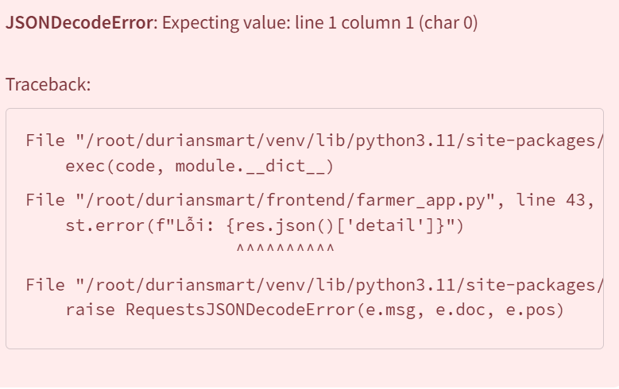

# Set up 
1. Tạo môi trường ảo và tải thư viện
- rm -rf venv // Xóa venv cũ
- python4 -m venv venv // Tạo môi trường mới
- pip install -r requirements.txt // Tải thư viện 
- Tải Extension: Aiken, DotENV, MongoDB for VS Code
- Aiken chạy terminal : curl -sSfL https://install.aiken-lang.org | bash Cài lõi biên dịch Aiken cho server mới.

# Ghi chú giai đoạn kiểm thử 
1. Kiểm tra sức khỏe
- Terminal -> pm2 status -> xác nhận 5 APP online (màu xanh)
- Kiểm tra log API Gateway -> pm2 logs api-core đảm bảo GPU nạp thành công Whisper vào VRAM mà ko tràn bộ nhớ
- Kiểm tra ví Cardano ENTERPRISE -> số dư đủ dùng ko

# Chạy code
1. Main.py
 source venv/bin/activate
uvicorn app.main:app --host 0.0.0.0 --port 8000 --reload --env-file .env

2. App farmer
source venv/bin/activate
streamlit run frontend/farmer_app.py --server.port 8501

3. App Enterprise
source venv/bin/activate
streamlit run frontend/enterprise_app.py --server.port 8502

4. source venv/bin/activate
streamlit run frontend/lab_app.py --server.port 8503

5. App tiêu dùng
source venv/bin/activate
streamlit run frontend/consumer_app.py --server.port 8504

# Lưu ý
- Do thuê GPU nên nó giới hạn số cổng -> dùng giải pháp xuyên tường lửa
1. Chạy code hoạt động app
2. Tạo đường hầm cho từng giao diện
2.1. Nông dân: 8501
npx localtunnel --port 8501
2.2. Doanh nghiệp
npx localtunnel --port 8502
2.3. Phòng Lab:
npx localtunnel --port 8503
2.4. Người tiêu dùng
npx localtunnel --port 8504

# Tải thư viện để chạy 
# 1. Tải danh sách cài đặt của Node.js (Bỏ sudo)
curl -fsSL https://deb.nodesource.com/setup_20.x | bash -

# 2. Cài đặt Node.js (Bỏ sudo)
apt-get install -y nodejs

# Đánh giá 
1. Cổng nông dân:
- Cần sửa lại giao diện thân thiện hơn
- Thiếu chức năng GPS
- Lúc nhấn lưu hồ sơ khởi tạo thì hiện lỗi: 

- Lâu lâu lại connecting liên tục 
- Giao diện còn sơ sài 
- Chưa lưu được hồ sơ nông dân và mảnh vườn 

2. Enterprise:
- Giao diện Sơ sài cực kỳ
- Bàn giao và đóng gói thiếu thông tin
- Cần design giao diện
- Giao diện theo hướng dashboard theo dõi tiến độ
- Phần đúc mã qr không hiện ra mã qr được, xác nhận bàn giao cũng không thao tác được. Phần bàn giao và đóng gói còn chung chung chưa biết làm việc với nông dân lúc thu mua hay giao cho lab kiểm định

3. Lab
- Giao diện sơ sài
- Phần kiểm duyệt cần có mục tải báo cáo kiểm định lên + upload giấy chứng nhận số lên
- Hàm lượng Cadimi và phải có Vàng O nữa cũng như dư lượng thuốc trừ sâu, thiếu mã cơ sở kiểm định,
- Thiết kế lại giao diện

4. Giao diện dành cho người dùng
- Sai theo định hướng vì giao diện này sẽ xuất hiện khi người dùng quét mã QR code được enterprise xuất và dán trên bao bì, lô xuất khẩu
- Nó sẽ chứa thông tin về farmer và enterprise đóng gói, xuất khẩu, toàn bộ quá trình chăm sóc theo thời gian, quá trình xử lý, đóng gói kết quả kiểm định từ Lab, chứng nhận số.
- Thiết kế lại giao diện